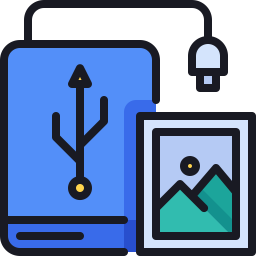

#  &nbsp;BackPhoto

**BackPhoto** is an application for backing up photos from your **Android Device**.

The app uses ADB and scans a connected device for specific files (based on their file extension), updates the EXIF information on photos to ensure the correct timestamp, then organises them into a destination folder.

## ADB Setup

Ensure that **USB Debugging** is enabled on your device to use the App.  
You can find instructions [here](https://developer.android.com/studio/debug/dev-options#Enable-debugging).

## Installation

**Windows** installers are available in [Releases](https://github.com/jcbyte/backPhoto/releases).

> Other operating systems are supported (however untested) and should be compiled from source.

## Run Locally

This project is an [Electron Forge](https://www.electronforge.io/) project which runs a python backend for ADB operations.

Install dependencies:

```bash
npm i
pip install -r backend\requirements.txt
```

Start app:

```bash
npm start
```

## Licence

[Apache License 2.0](LICENSE)
